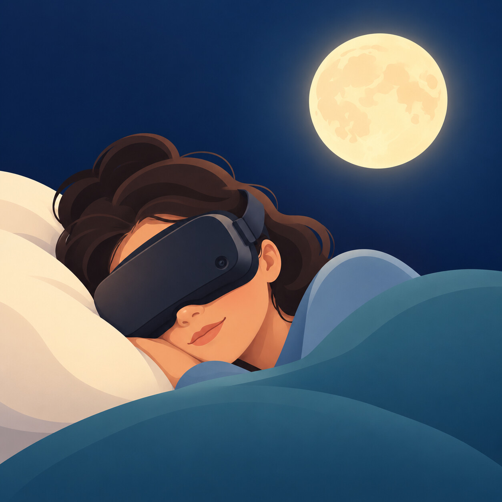

# SleepFrame

<p align="center"></p>

A sleep-sound program for the Steam Frame.

Put the headset on and lie on your side. You see the night side of the Earth, the stars and the Milky Way. Choose up to three sounds with your eyes, or do nothing and last night's mix begins. Close your eyes: the scene fades, the screens switch off, and the sound plays on in the dark. Press the Aux button to end.

It is free and it is a hobby project. Read the next section before you sleep in it.

## Read this before you sleep in it

- **Tested on one headset, by one person, for two days.**
- **The headset stays on all night.** The screens are off, but the headset is awake so it can play sound. On an earlier build it drew about 8 watts. It runs warm, and its fan blows warm air out of the top.
- **Do not bury the top of the headset in bedding.** SleepFrame does not watch the temperature.
- **Perhaps two and a half hours on battery.** That is an estimate from the power it draws, not a measured run of this version. Longer needs a charger. Sleeping in a headset with a cable attached is your own decision.
- **It needs Developer Mode**, and a second computer to install it from.
- **It needs eye tracking switched on.** You choose with your eyes, and closing them is what turns the screens off.
- **No warranty.** Offered as it is, under the MIT licence. You use it at your own risk.
- **Not made by Valve.** SleepFrame is not affiliated with, endorsed by or supported by Valve.

## Why this exists

I closed my eyes with the Steam Frame on and realized two things. It is a very good light blocker. And it can put sound in the ear that is touching the pillow, without earbuds.

The other reason is to show how good agents are at codecraft and creation. This project is the example.

## The sky is real

The stars are where the catalogue says they are, the Earth and the Milky Way are NASA's, and the nebulae are Hubble's. The work was putting real things in the right places, keeping them dim, and making sure nothing moves that shouldn't. Every sound was auditioned by ear on the headset before it was kept; most of what was gathered did not pass.

It is not finished. The list of what is not done is further down.

## How it works

1. **Start it and lie down.** The screen stays black until your head is still, then the scene appears. It stays where it is; it does not follow your head.
2. **The opening** shows three nebulae above the Earth:
   - **Orion nebula**, straight ahead: *as before*. Starts last night's mix and timer. On a first run it says *begin*.
   - **Ring nebula**, to the right: *choose*. Opens the menu.
   - **Cat's Eye nebula**, to the left: *not tonight*. Closes SleepFrame.
3. **To choose anything**, rest your eyes on it for two seconds. It swells and a ring draws round it. If you close your eyes at the opening instead, *as before* begins.
4. **The sound menu** shows seven sounds. Rest on one and it joins tonight's mix: its ring stays, and it keeps playing. Rest on it again and it leaves. You can have up to three; with three chosen, the others stand back. While you rest on a sound you hear it with the others.
5. **When the mix is right**, rest on the small star on the rim of the Earth: *that's my night*.
6. **The timer** asks for how long: 30, 60 or 90 minutes, or all night. When a timer ends, the sound fades out over its last five minutes and the headset is asked to go to sleep.
7. **The sky stays for as long as your eyes are open.** Close them for five seconds and the wind-down begins; about ten seconds later the screens are off and the sound carries on.
8. **To end**, press the **Aux button**, on the right side of the headset just above the power button. Taking the headset off also ends it after a minute.

SleepFrame does not use the power button.

## Sounds

| Sound | What it is | Source |
|---|---|---|
| Rain | heavy, steady rain heard from a porch | kyles, Freesound, CC0 |
| Ocean | waves breaking over a cliff | Joseph Sardin, BigSoundBank, CC0 |
| Wind | strong wind in trees | Joseph Sardin, BigSoundBank, CC0 |
| Thunder | distant thunder rolling over light rain | Joseph Sardin, BigSoundBank, CC0 |
| White noise | equal energy at every frequency | generated |
| Pink noise | equal energy in every octave | generated |
| Brown noise | deeper still: 6 dB less per octave | generated |

Thunder already has rain in it, so thunder with rain is a great deal of rain.

The four recordings are public domain. Each was trimmed, had its end folded into its start so the loop has no seam, and was set to a common level. Nothing else was done to them: no noise removal, no tone shaping, no compression. `sounds/SOURCES.tsv` lists every recording that was fetched, with its page; `sounds/LOOPS.tsv` says exactly what was cut from what.

The three noises are made by `noise/make_noise.py` and verified by `noise/check_noise.py`, which also proves its own checks can fail.

**Mixes do not fall into step.** Every loop is a prime number of seconds long (127 to 439), so no two share a period: the closest pair comes back into step only after about four and a half hours. Each sound also starts at a random point in its loop every night. A single sound on its own still repeats each time its loop comes round.

## What it keeps on the headset

Three small files, all on the headset and nowhere else: your last mix and timer (so *as before* works); the launcher's log of when it started, what was chosen and how it ended, with the battery level; and the frame rate of the most recent run. SleepFrame does not record where you look. It sends nothing anywhere.

## Design notes

- **Dark on purpose.** Blue light before sleep is unhelpful, so the Earth is shown by starlight, the nebulae are shifted warm, and the lettering is small and amber.
- **Nothing moves with your head.** The scene is fixed in place once it appears. A world that moves while you can see it makes people sick.
- **Nothing flashes.** Not even the thunder.
- **Made for side sleepers.** The battery at the back of the strap gets in the way otherwise.

## Installing

You need a PC on the same network as the headset, and Valve's free **SteamOS Devkit Client** (in your Steam library under Tools).

1. Download `SleepFrame-0.1.0.zip` from this repository's Releases page and unzip it. It is about 190 MB to download and 250 MB unzipped.
2. On the headset: **Settings → System → Developer Mode** on, then **Settings → Developer → Pair new host**.
3. On the PC, open the SteamOS Devkit Client, find the headset under **Devkits** (or connect by the name `frame`), and confirm the pairing on the headset.
4. Open **Title Upload** and fill in:
   - **Name:** `SleepFrame`
   - **Local Folder:** the unzipped `SleepFrame` folder
   - **Start Command:** `sleepframe`
   - **Runtime:** `Not specified`
5. Press **Upload**. SleepFrame then appears on the headset under **Library → Non-Steam → Devkit Game: SleepFrame**.

`icon.png` is in the folder if you want to give SleepFrame a picture of its own in your library.

These steps follow Valve's documentation for the tool. SleepFrame itself was installed and tested with the same tool's command-line scripts rather than its window, so if a step above does not match what you see, please open an issue.

The runtime matters: SleepFrame's launcher switches the screens off, listens for the Aux button and plays sound through the headset's own system, and it has only been run outside Steam's containers.

To use a recording of your own, replace `rain.ogg`, `ocean.ogg`, `wind.ogg` or `thunder.ogg` in the folder with your file under the same name. It must be Ogg Vorbis; an Opus file with an `.ogg` name will not play in the menu.

## Building it yourself

Everything the program loads at run time sits in one folder beside it. From a fresh copy of this repository, call that folder `build/`:

1. **The scene** is a Godot 4 project in `game/` (built with 4.7.2). All of it is one script, `game/main.gd`.
   ```
   mkdir build
   godot --headless --path game --import
   godot --headless --path game --export-release "Steam Frame Arm64" ../build/sleepframe.arm64
   ```
   That writes `sleepframe.arm64` and `sleepframe.pck`.
2. **The launcher** is `launcher/sleepframe`, a Python script with no dependencies beyond what SteamOS already has (`ffmpeg`, `pw-cat`). Copy it into `build/`.
3. **The noises:** `python3 noise/make_noise.py build`, then `python3 noise/check_noise.py build` to verify them.
4. **The recordings:** download the four originals named in `sounds/SOURCES.tsv` (the rows for sounds 2570, 1451 and 2719 on BigSoundBank and 454128 on Freesound) into `sounds/raw/` under the file names in the first column, then
   ```
   python3 sounds/make_loops.py rain-porch ocean-cliff wind-trees thunder
   cp sounds/loops/rain-porch.ogg build/rain.ogg
   cp sounds/loops/ocean-cliff.ogg build/ocean.ogg
   cp sounds/loops/wind-trees.ogg build/wind.ogg
   cp sounds/loops/thunder.ogg build/thunder.ogg
   ```
   Or simply take the seven sound files from the release zip.
5. **The stars** are already in `game/stars.dat`. To remake them, put `catalog.gz` from CDS catalogue V/50 (the Bright Star Catalogue) in `stars/` and run `python3 make_stars.py` there.

With the sounds in `build/`, the scene also runs flat on a desktop, without a headset, for looking at: `godot --path game -- state=sound mix=rain+wind`.

## Not done yet

- A temperature watch.
- Lower power use in the dark.
- Installing without a second computer.
- Controller support. It is eyes and the Aux button only.
- Volume for each sound in a mix. The balance is fixed.
- More sounds. A stream was wanted and no recording good enough was found.
- Other people's eyes. The eye choosing and the closed-eye detection were tuned on one person.

## Credits

- **Stars:** Bright Star Catalogue, 5th Revised Ed. (Hoffleit & Warren 1991), CDS catalogue V/50.
- **Milky Way:** NASA/Goddard Space Flight Center Scientific Visualization Studio, *Deep Star Maps 2020*. Gaia DR2: ESA/Gaia/DPAC.
- **Earth and clouds:** NASA, *Blue Marble*.
- **Orion nebula:** NASA, ESA, M. Robberto (Space Telescope Science Institute/ESA) and the Hubble Space Telescope Orion Treasury Project Team.
- **Ring nebula:** NASA, ESA, and C. Robert O’Dell (Vanderbilt University).
- **Cat's Eye nebula:** ESA, NASA, HEIC and The Hubble Heritage Team (STScI/AURA).
- **Lagoon nebula** (pink noise): NASA, ESA, STScI.
- **Jupiter** (brown noise): NASA, ESA, A. Simon (GSFC), M. Wong (UC Berkeley), and G. Orton (JPL-Caltech).
- The five pictures above are ESA/Hubble's, under CC BY 4.0, and were cropped, dimmed and warmed for this scene.
- **Sounds:** Joseph Sardin (BigSoundBank.com) and kyles (Freesound), all CC0.
- **Lettering:** Cormorant Garamond, SIL Open Font Licence.
- **Engine:** Godot 4.

Links, licences and what was changed are in [`CREDITS.md`](CREDITS.md). The licence texts for the font and the engine are in `licenses/`.

## Licence

MIT for the code. The pictures, the star catalogue, the font and the sounds keep their own terms; see `CREDITS.md`.
